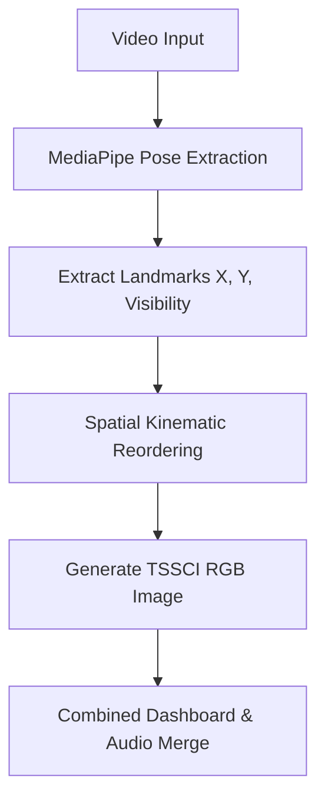

# AI Expert: Multi-Person Pose TSSCI Pipeline

This project implements a modular pipeline for multi-person pose extraction, 2D motion visualization (TSSCI), and high-quality side-by-side playback. It transforms complex human movement into abstract "motion fingerprints" suitable for action recognition and kinematic analysis.

---

## 🚀 Key Features
- **Multi-Person Tracking**: Extracts and processes up to 3 people simultaneously from a single video source.
- **TSSCI (Temporal Spatial Skeleton Color Image)**: 
    - **X-Axis**: Keypoints ordered by kinematic sequence (head → arms → torso → legs).
    - **Y-Axis**: Temporal dimension (frames).
    - **RGB Encoding**: X (Red), Y (Green), Visibility (Blue).
- **High-Quality Dashboard**: Side-by-side visualization of the animated skeleton and its corresponding TSSCI heatmap.
- **Audio Integration**: Automatically merges original audio back into all output videos.
- **Modular Design**: Separates landmark extraction, data processing, and visualization.

---

## 📂 Project Structure
```text
L44-Homework/
├── assets/                # Visualizations & Generated Assets
│   ├── tssci_person_1.png # Individual motion fingerprints
│   ├── skeleton_overlay.mp4 # Skeletons drawn over original video
│   ├── skeleton_only.mp4    # Pure skeleton movement (black BG)
│   └── skeleton_tssci_combined.mp4 # Side-by-side analysis dashboard
├── code/                 # Source Code
│   ├── config.py         # Kinematic ordering & global constants
│   ├── model.py          # MediaPipe Pose Landmarker integration
│   └── main.py           # Pipeline orchestration & visualization
├── pose_landmarker.task  # MediaPipe model file
├── requirements.txt      # Dependencies
└── README.md             # Documentation
```

---

## 📊 The TSSCI Visualization
The **TSSCI Dashboard** (found in `skeleton_tssci_combined.mp4`) provides a dual-view analysis:
- **Left Panel**: Real-time skeleton reconstruction from the encoded TSSCI data.
- **Right Panel**: The full TSSCI image with a moving "Time Cursor" (yellow line) that syncs with the playback.


**How to read the TSSCI image:**
- **The "Waves"**: Horizontal patterns represent joint movement over time.
- **RGB Channels**: Red (X-coord), Green (Y-coord), Blue (Confidence).
- **X-Axis**: Spatial Dimension (kinematically ordered joints).
- **Y-Axis**: Temporal Dimension (time flowing top to bottom).

---

## 🔄 Data Flow & Transformation



---

## ⚙️ Installation & Usage

### 1. Setup Environment
```bash
# Create and activate virtual environment (optional)
python -m venv venv
.\venv\Scripts\activate

# Install dependencies
pip install -r requirements.txt
```

### 2. Run the Pipeline
To process a video file and generate all assets:
```bash
python -m code.main --source assets/test_video.mp4
```

### 3. CLI Arguments
- `--source`: Video path or webcam index (default: `assets/test_video.mp4`).
- `--max-frames`: Limit processing to a specific number of frames.
- `--no-preview`: Disable the real-time OpenCV window during processing.

---

## 🛠️ Technical Implementation Notes
- **DFS Kinematic Order**: Landmarks are reordered to preserve spatial continuity.
- **Temporal Consistency**: The pipeline detects and respects the source video's FPS, ensuring synchronization.
- **Confidence Thresholding**: Joints are only rendered if visibility exceeds `0.4`.

---

## 🤝 Credits & Acknowledgments
Built with **MediaPipe**, **Matplotlib**, and **MoviePy**. Special thanks to the AI Expert course for the architectural inspiration.
