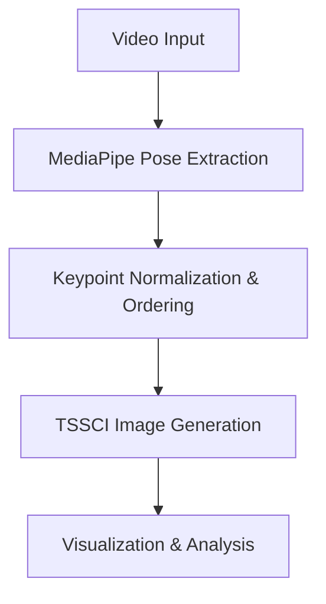
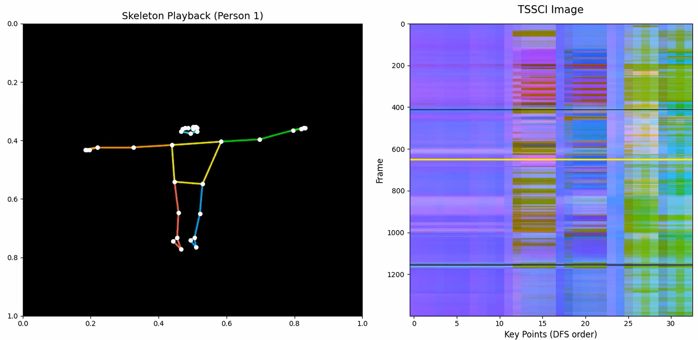

# Pose TSSCI: Temporal Spatial Skeleton Color Image

Welcome to the Pose TSSCI project! This modular pipeline transforms 3D skeleton keypoints from video into a unique, abstract 2D color image (TSSCI), enabling visual comparison and action recognition.

---

## 🚀 Overview
Human movement is complex and multi-dimensional. Pose TSSCI simplifies this by:
- Extracting 3D pose landmarks from video
- Mapping them into a visually intuitive 2D color image (TSSCI)
- Enabling easy comparison, visualization, and machine learning applications

---

## 🌟 Features
- Converts raw pose data into a compact, visual "motion fingerprint"
- Preserves spatial and temporal relationships
- RGB encoding: X (Red), Y (Green), Visibility (Blue)
- Ready for 2D CNN-based action recognition
- Modular, easy-to-extend pipeline

---

## 🖼️ TSSCI Explained
**Temporal Spatial Skeleton Color Image (TSSCI):**
- **X-axis:** Keypoints ordered by kinematic connections (head → arms → torso → legs)
- **Y-axis:** Each row = one frame in time
- **RGB:**
    - **Red:** Normalized X-coordinate
    - **Green:** Normalized Y-coordinate
    - **Blue:** Visibility/confidence score

This abstraction makes movement patterns easy to compare and analyze.

---

## 📂 Project Structure
```text
L44-Homework/
├── assets/                # Results & visualizations
│   ├── tssci.png         # Generated motion image
│   └── skeleton_overlay.mp4 # Skeleton video
├── code/                 # Core logic
│   ├── config.py         # Keypoint ordering & config
│   ├── model.py          # MediaPipe processing
│   └── main.py           # Pipeline orchestration
├── requirements.txt      # Dependencies
├── README.md             # Documentation
└── Test_Video.mp4        # Input video
```

---

## 🔄 Data Flow & Transformation


### Pipeline Steps
The following Mermaid diagram visually explains the transformation pipeline:



---

## ⚙️ Installation & Usage

1. Install dependencies:
   ```bash
   pip install -r requirements.txt
   ```
2. Run the pipeline:
   ```bash
   python -m code.main --source .\assets\Test_Video.mp4
   ```
3. View results in the `assets/` folder.

---

## 📸 Sample Outputs
- **TSSCI Image:** 
- **Skeleton Overlay Video:** [skeleton_overlay.mp4](assets/skeleton_overlay.mp4)

---

## 🤝 Credits
Built with MediaPipe, Python, and a passion for human movement analysis.

---

## 📚 References
- [MediaPipe Pose Documentation](https://google.github.io/mediapipe/solutions/pose.html)
- [Action Recognition with CNNs](https://arxiv.org/abs/1705.08168)
    B --> C[Extract Landmarks (X, Y, Visibility)]
    C --> D[Spatial Kinematic Reordering]
    D --> E[Normalization (0-255)]
    E --> F[Generate TSSCI RGB Image]
    F --> G[Save to assets/tssci.png]
    G --> H[TSSCI Player: Row-by-Row Reconstruction]
```

### 3.2 Visual Fingerprint (TSSCI)
This is the "motion fingerprint" generated by the pipeline. It collapses complex 3D movement into a single 2D texture.


**How to read this image:**
- **The "Waves"**: Horizontal patterns represent the movement of joints over time. A smooth, flowing wave indicates a fluid movement (like a dance), while jagged lines indicate jitter or rapid, jerky motions.
- **The "Colors"**:
    - **Red (R)**: Encodes the normalized **X-coordinate**.
    - **Green (G)**: Encodes the normalized **Y-coordinate**.
    - **Blue (B)**: Encodes the **Visibility/Confidence** score. Black spots indicate occluded or undetected joints.
- **The X-Axis**: Represents the **Spatial Dimension** (the specific joints ordered kinematically).
- **The Y-Axis**: Represents the **Temporal Dimension** (time flowing from top to bottom).

---

## 4. Visual Results & Asset Explanation

The pipeline generates several key files in the `assets/` directory to help analyze movement:

### `assets/skeleton_overlay.mp4`
A standard video overlay where the 2D skeleton is drawn directly on the original video frames. This serves as a "ground truth" to verify that MediaPipe is tracking the subject correctly before the abstract TSSCI transformation.

### `assets/skeleton_only.mp4`
A high-contrast, black-background version of the skeleton. 
- **Purpose**: Stripping the background allows for "pure" movement analysis, focusing solely on the kinematic chain.
- **Audio Integration**: We use `ffmpeg` to re-insert the original audio, allowing you to hear the context (music, instructions) while watching the abstract movement.

---

## 5. Usage Examples

### A. Processing a Video File
To analyze a local mp4 file and generate TSSCI images for all detected people:
```powershell
python -m code.main --source assets/test_video.mp4 --fps 30
```

### B. Live Webcam Analysis
Run the pipeline in real-time using your default webcam:
```powershell
python -m code.main --source 0
```

### C. Quick Research (Partial Processing)
To quickly test the pipeline without processing a long video, use the `--max-frames` flag:
```powershell
python -m code.main --source assets/test_video.mp4 --max-frames 100 --no-preview
```

---

## 6. Technical Depth: Missing Points & Lines
You may notice occasional flickering or missing segments in the generated skeleton. This is an intentional design choice in `code/model.py`:

1.  **Confidence Gate**: We use a `visibility > 0.4` threshold. If a joint (like a wrist) is hidden behind the back, its confidence drops. Drawing it would result in "hallucinated" points that jump randomly. By suppressing these, the TSSCI image stays "cleaner" for machine learning models.
2.  **Kinematic Connectivity**: A line is only drawn if **both** connected joints meet the visibility threshold. This prevents "phantom limbs" where a line stretches to an incorrectly detected point.

## 7. Honest Assessment
### What Worked:
- **Kinematic Spatial Ordering**: The reordering of landmarks (head-arms-torso-legs) successfully avoided "noise" in the TSSCI image by grouping related joints, making the movement patterns visually cohesive.
- **Reconstruction Player**: The player accurately maps RGB channels back into 2D coordinates, proving the transformation is nearly lossless (within quantization limits).
- **Audio Integration**: Restoring the audio to the skeleton-only output provides critical temporal context (e.g., timing movements to music or speech).

### What Failed / Challenges:
- **Depth Information Loss**: By mapping only X and Y to R and G, the Z-depth information is discarded. This makes it impossible to reconstruct movements that involve rotation towards/away from the camera.
- **Occlusion Sensitivity**: When joints are occluded, the blue channel (visibility) drops. In the current TSSCI image, this appears as dark "holes" in the pattern, which can break the continuity of the spatial axis.
- **Scale Invariance**: The current normalization is absolute to the frame. If the subject moves significantly within the frame, the "color" shifts, potentially confusing pattern recognition models.

## 6. What Needs to Be Done (Next Steps)
| Feature | Priority | Solution |
| :--- | :---: | :--- |
| **3D Support** | High | Map Z-coordinate to an Alpha channel or a separate 4th channel image. |
| **Normalization** | Medium | Normalize coordinates relative to the subject's center (hip/torso) instead of the frame. |
| **Smoothing** | Low | Apply a temporal Kalman filter or Savitzky-Golay filter to reduce jitter in the TSSCI rows. |

## 7. Setup & Usage
### Installation
Create a virtual environment and install dependencies:
```powershell
python -m venv venv
.\venv\Scripts\activate
python -m pip install -r requirements.txt
```

### Execution
Run the full pipeline using the test video:
```powershell
python -m code.main --source Test_Video.mp4
```
For webcam analysis:
```powershell
python -m code.main --source 0
```

## 8. Dataset
Input used: `Test_Video.mp4`.
Detection Framework: [MediaPipe Pose Landmarker](https://developers.google.com/mediapipe/solutions/vision/pose_landmarker).
